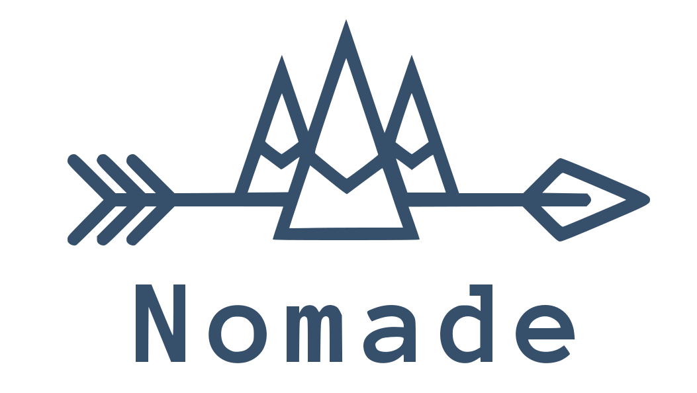

.. Nomade documentation master file, created by
   sphinx-quickstart on Sat Aug 24 23:24:41 2019.
   You can adapt this file completely to your liking, but it should at least
   contain the root `toctree` directive.
   RST examples: https://pythonhosted.org/an_example_pypi_project/sphinx.html

Python Migration Manager for Humans.

.. toctree::
   :maxdepth: 2
   :caption: Contents:

   installation
   quickstart
   testing
   contributing
   changelog

Modules
-------

.. toctree::
   :maxdepth: 2
   :caption: Contents:

   nomade
